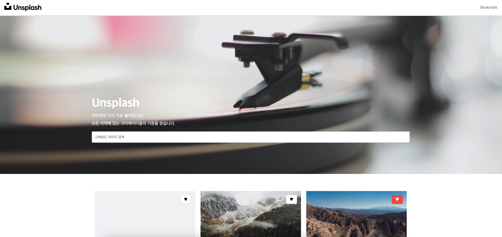
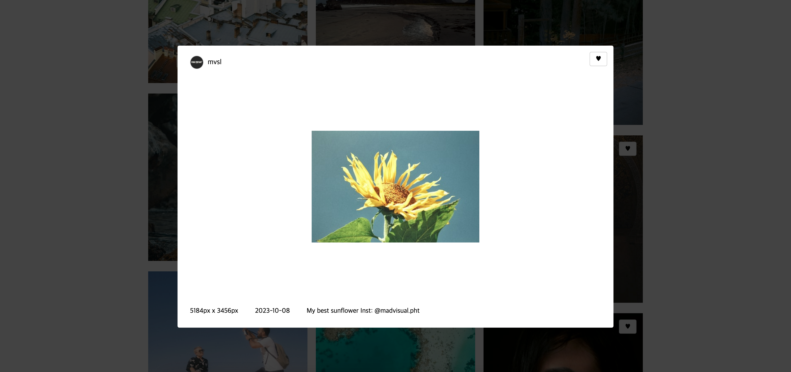
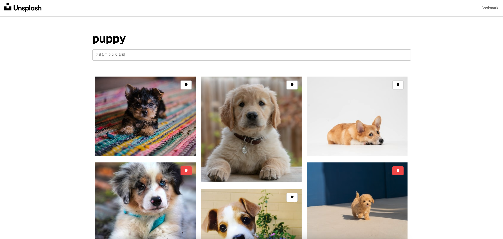
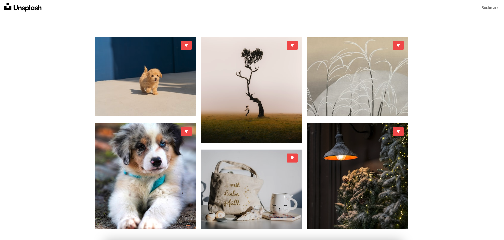

# teamreboott-intership

teamreboott intership frontend develop 사전 과제 제출용 repository입니다.

## 개요

[Unsplash](https://unsplash.com/ko) 클론 코딩 웹페이지입니다.
**React**, **Typescript**와 **Electron**을 사용하여 개발되었습니다.

## 구현 사항

### 레이아웃

- [x] : 헤더 로고 클릭시 메인 페이지로 이동합니다.
- [x] : 북마크 클릭시 북마크 페이지로 이동합니다.

### 메인

- [x] : 사용자가 찾고자 하는 이미지에 대한 쿼리를 이동하면 결과 리스트 페이지로 이동합니다.
- [x] : 검색된 이미지 클릭 시 상세 모달이 나타납니다.

### 북마크

- [x] : 이미지 내 북마크 버튼을 누르면 북마크에서 삭제됩니다.
- [x] : 북마크 기록은 검색 페이지와 동기화됩니다.

## 코드 실행

- `npm start` : 로컬에서 서비스를 실행합니다.
- `npm run electron` : electron을 이용해 서비스를 배포합니다.
    tsc ./public/electron.ts && react-scripts build && electron-builder build

## 상세 화면

### 상세 모달

### 검색 페이지

### 북마크 페이지

